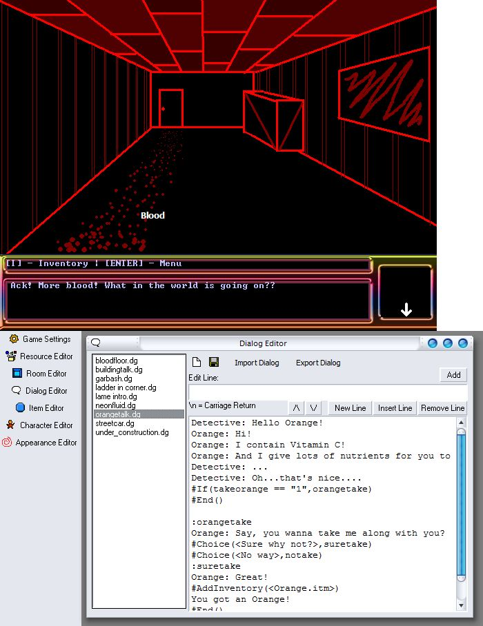



## DarkRAD: Rapid Adventure Development Game Engine

### Description

DarkRAD is an graphical Rapid Adventure Development Game engine created in Visual Basic. It features a first person view, point-and-click gameplay, just like most old-school adventure games. It is currently under development, but so far it supports sound, graphical effects and game programming with the easy to use built-in programming language called DialogScript. The Engine also includes an intuitive game editor to help you create graphical adventure games.
 
### More Info
 

             |
---                |---
**Submitted On**   |2005-01-02 20:30:08
**By**             |[Remerico Cruz](https://github.com/Planet-Source-Code/PSCIndex/blob/master/ByAuthor/remerico-cruz.md)
**Level**          |Intermediate
**User Rating**    |4.0 (28 globes from 7 users)
**Compatibility**  |VB 6\.0
**Category**       |[Complete Applications](https://github.com/Planet-Source-Code/PSCIndex/blob/master/ByCategory/complete-applications__1-27.md)
**World**          |[Visual Basic](https://github.com/Planet-Source-Code/PSCIndex/blob/master/ByWorld/visual-basic.md)
**Archive File**   |[DarkRAD\_\_R184725222005\.zip](https://github.com/Planet-Source-Code/remerico-cruz-darkrad-rapid-adventure-development-game-engine__1-58645/archive/master.zip)

